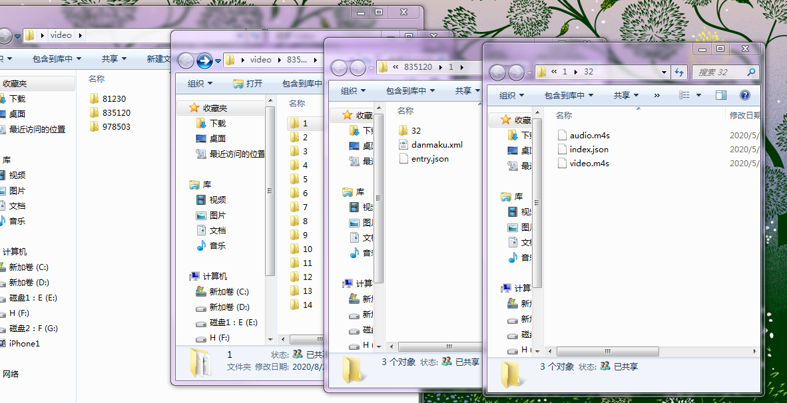

# 使用方法：
   1.必须安装 ffmpeg ，保证在 cmd上输入  ffmpeg  有正确输出如下：

    
 
 
   
   2.必须安装jdk1.8或以上
 
 
            
   3.把压缩包下载到本地
   https://github.com/cctyl/merge-bilibili-video/releases/tag/1.0

   解压，把视频资源放到D:\mergerBilibili 目录下，如下图所示
   

双击执行  开启-使用默认位置.bat
如果你不想使用这个位置，编辑 开启-使用自定义位置（需要先自行修改） .bat

然后双击开始执行
合并后的文件会放到如下目录 

   

 
   
        
**注意事项**：

1.每次点击都会把资源文件下的所有视频都执行一遍操作，所以合并后的视频文件请挪走
  
2.务必保证资源文件目录结构是这样的：
     
           
根目录指的是这个：
             
在android中根目录在这
             
             
一级目录：
二级目录：
三级目录：